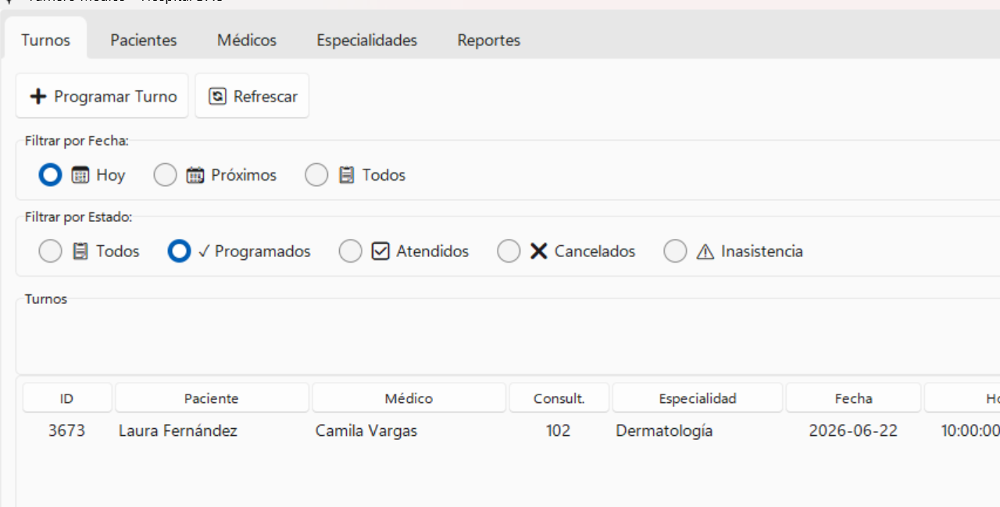
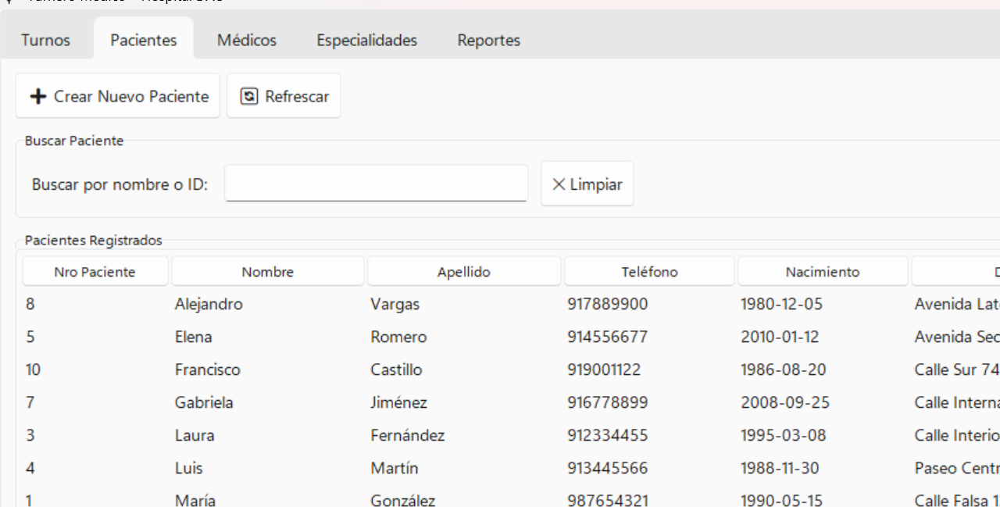
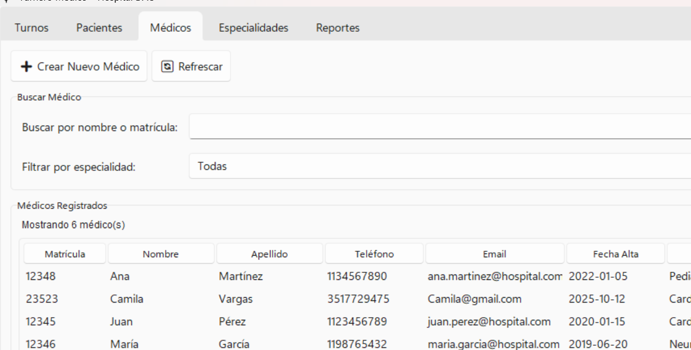
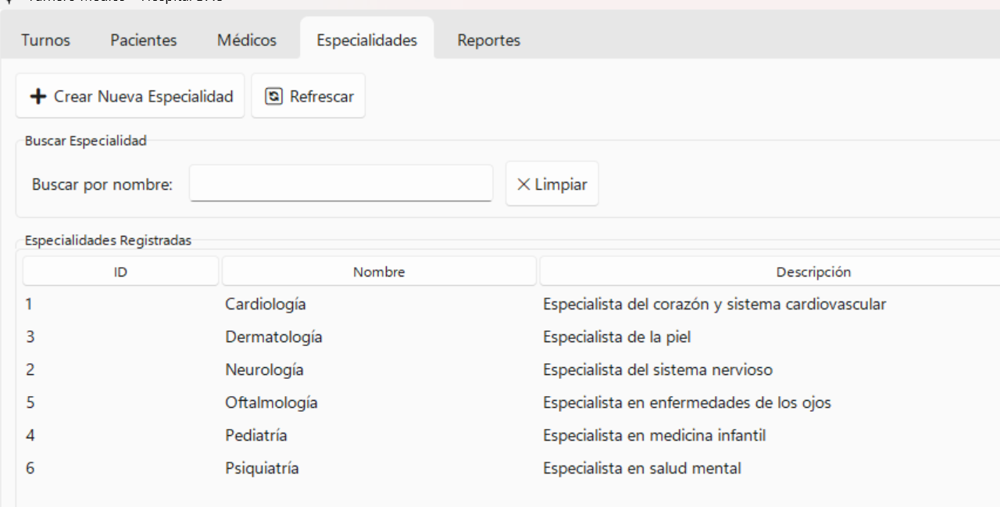
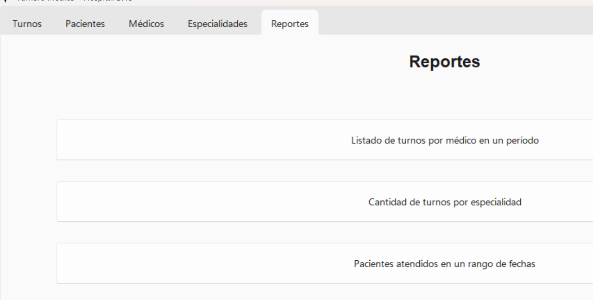
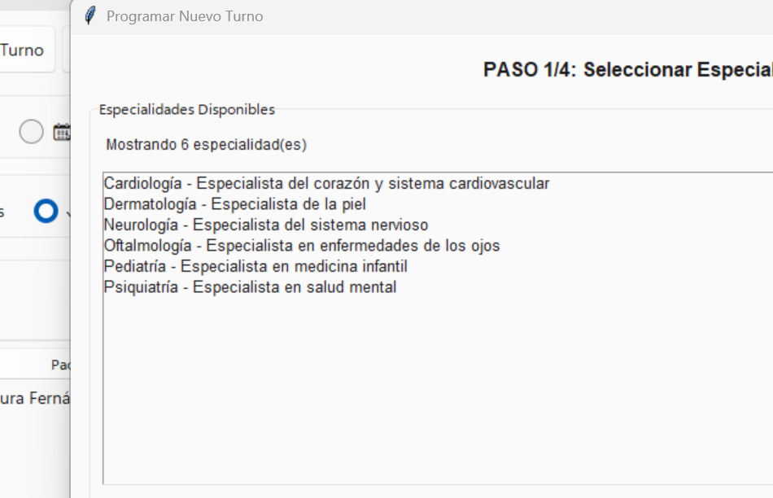

# Turnero Médico — UTN (TPDAO)

Sistema de gestión de turnos médicos para una clínica hospitalaria. Aplicación de escritorio construida con Python + Tkinter y MySQL, aplicando la arquitectura **Entity-Control-Boundary (ECB)** de Jacobson.

Desarrollado como trabajo práctico integrador para la materia **Desarrollo de Aplicaciones con Objetos** — UTN-FRC.

---

## Capturas

| Turnos | Pacientes |
|--------|-----------|
|  |  |

| Médicos | Especialidades |
|---------|----------------|
|  |  |

| Reportes | Programar turno |
|----------|-----------------|
|  |  |

---

## Funcionalidades

- Gestión de turnos: programar, cancelar, registrar atención, inasistencia automática
- ABM de médicos, pacientes y especialidades
- Historial clínico por paciente
- Recetas médicas con generación de PDF y código QR
- Notificaciones por email (recordatorio de turno, inasistencias)
- Scheduler automático de notificaciones cada 5 minutos
- Reportes y estadísticas con gráficos (matplotlib)

---

## Arquitectura ECB

```
turnero-hospital-UTN/
│
├── entities/                   ← [E] Entidades de dominio
│   ├── states/                 ←     Patrón State (ciclo de vida del turno)
│   │   ├── libre.py            ←     Libre → Programado
│   │   ├── programado.py       ←     Programado → Atendido / Cancelado / Inasistencia
│   │   ├── atendido.py
│   │   ├── cancelado.py
│   │   └── inasistencia.py
│   ├── turno.py                ←     Entidad principal con State pattern
│   ├── medico.py
│   ├── paciente.py
│   ├── agenda.py
│   ├── especialidad.py
│   ├── receta.py
│   ├── historial_clinico.py
│   ├── notificacion.py
│   └── exceptions.py           ←     Excepciones de dominio tipadas
│
├── control/                    ← [C] Casos de uso (Gestores con DI)
│   ├── gestor_turno.py         ←     Programar, cancelar, filtrar turnos
│   ├── gestor_medico.py
│   ├── gestor_paciente.py
│   ├── gestor_especialidad.py
│   ├── gestor_receta.py
│   ├── gestor_notificacion.py
│   └── scheduler_notificaciones.py
│
├── boundary/                   ← [B] Adaptadores a sistemas externos
│   ├── persistence/            ←     DAOs — toda la SQL centralizada aquí
│   │   ├── database.py         ←     Singleton + context manager + dotenv
│   │   ├── turno_dao.py
│   │   ├── medico_dao.py
│   │   ├── paciente_dao.py
│   │   ├── especialidad_dao.py
│   │   ├── agenda_dao.py
│   │   ├── notificacion_dao.py
│   │   └── receta_dao.py
│   └── services/               ←     Servicios externos
│       ├── email_service.py    ←     SMTP (Gmail)
│       └── pdf_service.py      ←     Generación de recetas con reportlab
│
├── frontend/                   ← [B] Interfaz Tkinter
│   ├── app.py                  ←     Entrypoint
│   ├── main_window.py          ←     Ventana principal + scheduler
│   ├── controllers/            ←     Thin controllers → delegan al Control
│   ├── views/                  ←     Pestañas principales
│   ├── dialogs/                ←     Ventanas modales
│   ├── widgets/                ←     Widgets reutilizables (ScrollableFrame)
│   └── styles/                 ←     Tema sv-ttk
│
├── tests/                      ← 54 tests unitarios (sin base de datos)
│   ├── test_entities.py        ←     Entidades: validaciones, State pattern
│   ├── test_gestor_turno.py    ←     GestorTurno con mocks de DAOs
│   ├── test_gestor_medico.py
│   └── test_gestor_paciente.py
│
├── data/sql/
│   ├── create.sql              ←     DDL — estructura de la base de datos
│   └── inserts.sql             ←     Datos de ejemplo
│
├── .env.example                ←     Variables de entorno (copiar a .env)
└── requirements.txt
```

### Decisiones de diseño

| Principio | Aplicación |
|---|---|
| **SRP** | Cada DAO maneja una sola tabla. Cada Gestor orquesta un solo agregado. |
| **DIP** | Los Gestores reciben DAOs por constructor — no crean dependencias. Los tests reemplazan DAOs con `MagicMock`. |
| **OCP** | El ciclo de vida del turno se extiende agregando un nuevo `EstadoTurno`, sin tocar los existentes. |
| **Patrón State** | `Turno` delega transiciones a su estado actual. Una transición inválida lanza `EstadoInvalidoError`. |
| **Singleton** | `Database` — una única conexión compartida por todos los DAOs vía `__new__`. |
| **Context manager** | `with db:` abre y cierra la conexión automáticamente (`__enter__`/`__exit__`). |
| **Excepciones tipadas** | `EntidadNoEncontradaError`, `EstadoInvalidoError`, `DuplicadoError`, `ValidacionError` en lugar de retornar `bool`. |

---

## Requisitos

- Python 3.10+
- Docker (para MySQL)

---

## Instalación

### 1. Clonar e instalar dependencias

```bash
git clone https://github.com/cirogiordano17/turnero-hospital-UTN.git
cd turnero-hospital-UTN
pip install -r requirements.txt
```

### 2. Configurar variables de entorno

```bash
cp .env.example .env
```

Editar `.env` con las credenciales reales:

```env
DB_HOST=127.0.0.1
DB_PORT=3306
DB_USER=root
DB_PASSWORD=tu_password
DB_NAME=hospital_db

EMAIL_SENDER=tu_email@gmail.com
EMAIL_PASSWORD=tu_app_password
```

> Para Gmail con 2FA: usá una [App Password](https://myaccount.google.com/apppasswords), no la contraseña de la cuenta.

### 3. Levantar MySQL con Docker

```bash
docker run -d \
  --name hospital_db \
  -e MYSQL_ROOT_PASSWORD=tu_password \
  -e MYSQL_DATABASE=hospital_db \
  -p 3306:3306 \
  mysql:8 \
  --lower_case_table_names=1 \
  --character-set-server=utf8mb4 \
  --collation-server=utf8mb4_unicode_ci
```

Si ya tenés el contenedor:

```bash
docker start hospital_db
```

### 4. Crear la base de datos

```bash
docker exec -i hospital_db mysql -uroot -ptu_password hospital_db < data/sql/create.sql
docker exec -i hospital_db mysql -uroot -ptu_password hospital_db < data/sql/inserts.sql
python data/generar_turnos.py
```

### 5. Correr la aplicación

```bash
python -m frontend.app
```

En Windows con acentos:

```powershell
$env:PYTHONIOENCODING = "utf-8"; python -m frontend.app
```

---

## Tests

Los tests unitarios corren **sin base de datos** — los DAOs se reemplazan con mocks:

```bash
python -m pytest tests/ -v
```

```
54 passed in 0.36s
```

---

## Stack

| Componente | Tecnología |
|---|---|
| Lenguaje | Python 3.13 |
| UI | Tkinter + sv-ttk (tema Windows 11) |
| Base de datos | MySQL 8 (Docker) |
| ORM / Acceso a datos | mysql-connector-python (DAOs propios) |
| Generación de PDF | reportlab |
| Gráficos | matplotlib |
| Email | smtplib (Gmail SMTP) |
| Tests | unittest + pytest + MagicMock |
| Variables de entorno | python-dotenv |
